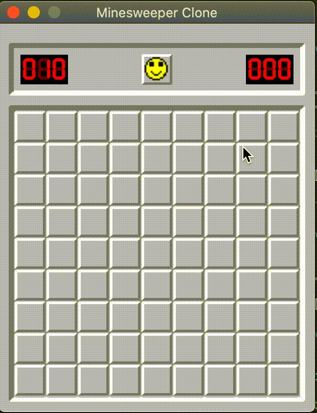

# Minesweeper-Clone
This is a clone of Minesweeper created using Spring and JavaFx11. 

## Purpose
This project serves as a platform for me to practice Spring, Javafx11 and other programming concepts.

### Concepts Used in This Project
- Observer Pattern 
    -  Used the Spring Framework's ApplicationContext event mechanism.
- MVC Pattern 
    - The Model is a Spring Component.
    - JavaFx FXML is the View
    - The Controllers are both Javafx Controllers and Spring Components.

## Run It For Yourself
You can build a jar file and run it from the command line:

	git clone https://github.com/denzelhall20/Minesweeper-Clone.git
	cd Minesweeper-Clone
	./mvnw package
	java -jar target/*.jar

## Future
Minesweeper can be an intimidating game to beginner. The ability to automatically flag a bomb and solve the game, can be added to help with this.